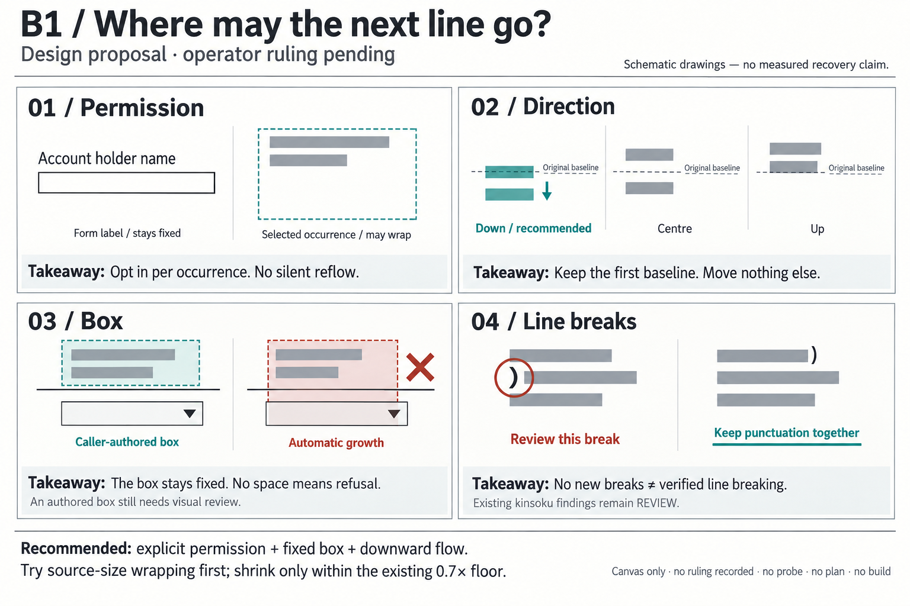

# B1 design canvas — where may the next line go?

**Status:** recommended direction approved by Rodrigo, 19 September 2026.
Design ruling only; implementation is pending. The first
[recovery probe](../../reviews/2026-09-19-b1-recovery-probe.md) is complete:
6 of 8 synthetic stress cases fit without added pages, but all six shift the
first baseline. Customer recovery remains unmeasured. **Further B1 work is
deferred by the operator until a genuine fit-refusal case is available.** The
subsequent [real-job capture](../../reviews/2026-09-19-b1-captured-case.md) was a
known successful replay, so it did not supply that case. The approved design
remains the reference; no implementation plan or build has started.
[Short note for the web-app session](WEB-APP-NOTE.md).

**Approved constraint:** preserve the exact source page count and keep each occurrence
on its original page. Extra lines use only the authorized box on that page;
overflow never creates a continuation page or pushes content onto the next one.

**Approved direction:** explicit permission for one occurrence, a caller-authored fixed
box, and extra lines below the original first baseline. Try wrapping at source
size before shrinking. Keep the existing 0.7× floor and explicit exceptions.

**Choice recorded:** A, with exact page-count preservation. The PNG above is
the original pre-ruling sketch, preserved for reference; its pending-status
labels are historical. This approval settles the direction, not its feasibility
or an implementation plan.

Technical detail (skip freely)

## What this canvas is

The four decisions in [the B1 brief](../../BRIEF-product-bubble-2026-09-18.md),
drawn before implementation. The image is an illustrative decision sketch:
its text bars, dimensions, and punctuation placements are not PDF output or
measurements. It makes no claim about recovered runs, typography quality, or
kinsoku conformance. This is a static canvas, with no executable prototype.

The intended user is the mapping author or library caller. This proposes
placement behavior and information they need; it does not design a product UI,
choose an API signature, or specify a mapping schema.

## Four decisions, approved direction

| Decision | Recommended behavior | Alternative and visible cost |
| --- | --- | --- |
| **Permission** | Ordinary occurrences stay on their present path unless the caller explicitly selects an occurrence and supplies its box. Document class and geometric warnings do not grant permission. | Retain the current explicit merge workflow. It already reflows paragraphs but leaves the caller with today's authoring burden. A document-wide automatic switch would change the no-silent-reflow promise and needs a separate ruling; it is not included in A. |
| **Direction** | Preserve the first source baseline and the occurrence's horizontal anchor; subsequent lines extend down inside the authorized box. If the box cannot accommodate that anchor, report the conflict rather than move it. | Centre or grow up: both consume space above the original line. Top-align to a box: easier to describe as paragraph layout, but changes the original baseline. The drawing shows the displacement, not a font-metric proof. |
| **Box** | The caller supplies a fixed region in source-page coordinates. It must contain the complete placed text. No automatic expansion, new page, moved rule, moved widget, moved neighbor, or inferred safe area. | A union of source ink often has no room for an extra line. Growing that box automatically can cross a field or rule. Existing authored merge boxes remain available. |
| **Line breaks** | Once wrapping is permitted, prefer breaks that obey the applicable CJK restrictions and preserve the authored text. Keep gate 19's existing advisory REVIEW policy. Expose what was actually audited and whether any new breaks were made. | Keep current single lines: a clean line audit cannot demonstrate a new breaker's correctness. Treating all findings as a hard refusal would be a separate policy change, with form-label false positives. |

**Permission attaches to a location, not just a repeated string.** If the same
label occurs in a roomy paragraph and a tight form cell, selecting the former
must not reflow the latter. How a caller unambiguously identifies that occurrence
is unresolved. No new identifier or schema is prescribed here.

**The caller owns the box.** An explicit box is an instruction, not evidence
that the area is empty. A caller can draw it over a rule or field; the visual
review still has to catch that. This canvas adds no obstacle detection or
collision guarantee. That preserves R6 in
[the product inbox](../../REQUESTS-from-product.md).

## What the reader would see under A

| Situation | Intended visible result |
| --- | --- |
| No wrapping permission | Today's placement behavior, including reported shrinking and refusal below the floor unless explicitly excepted. |
| Permission, target fits on one line | One line at the source baseline and size. Permission alone does not force an extra line. |
| Permission, extra line fits in the box | Full-size text continues below the first line. Rules, fields, neighbors and page count stay put. |
| Permission, full-size wrapping still cannot fit | Shrink within the same box and the existing floor. Report the effective size relative to the source, not just a layout engine's internal scale. Existing explicit scale exceptions stay explicit. |
| Cannot fit at the permitted minimum, or placement conflicts with the requested anchor | A build refusal identifying the occurrence and reason. No clipping, enlarged box, omitted target, or automatic source-language substitution. |
| A translation would need another page | Refuse that placement. The author can supply shorter wording that preserves the meaning or explicitly revise a box on the same page. The library neither summarizes away content nor adds an overflow page. |
| New CJK breaks | Show that new breaks occurred, what was audited, and any findings. A clean sampled/restricted check is not full language-layout certification. |
| No new breaks | Say that line-breaking behavior was not exercised. Existing delivered lines may still have meaningful kinsoku findings. |
| Audit coverage unavailable | Say unknown or not checked, rather than infer coverage from a clean result or from having called the Story engine. |

The information a caller needs is the selected occurrence and full source key,
authorized box, whether text wrapped, effective scale, and refusal or review
reason. The spelling, format, and storage of that information remain undecided.
The existing gate has no input identifying newly created breaks; the proposed
disclosure cannot be obtained merely by renaming its current PASS message.

## Boundaries and unresolved evidence

- Source paragraphs split across several segments still need one authored
  paragraph. This proposal does not auto-merge adjacent labels or sibling items.
- Rotation, vertical text, mirroring, right/centre alignment, list markers,
  trailing symbols and dot leaders cannot silently be treated as plain left-to-right
  paragraphs. Whether each can preserve its anchors under A is unmeasured. An
  unsupported requested wrap must be explicit; existing paths keep their rules.
- Shaping, font attribution, logical text, color and style must survive wrapping.
  A pleasant image or a glyph count alone does not prove those properties.
- Line spacing for an originally single-line occurrence has no measured source
  baseline gap. Its default and caller control remain unresolved; this sketch
  deliberately gives no numeric leading or padding.
- The brief's product counts and its estimate of coverage benefit were not
  reproduced. The first probe covers eight deliberately stressed occurrences
  and two saved final jobs; it does not establish a customer recovery rate.
  We still do not know the recoverable share or mix of useful document classes.
  Existing merges fit six stress targets, but baseline shifts and first-match
  selection of repeated labels prevent treating that route as a B1 implementation.

## Outcomes that would make the direction acceptable

These are proposed observable outcomes for a later evaluation, not a work plan
or claims that tests have run.

| Intended outcome | Verify-by method |
| --- | --- |
| Every successful translated PDF has exactly the source page count; text remains on its source page | Reopen source and output and compare page counts. On a constructed last-page overflow case, check for a build refusal rather than a continuation page; on a multi-page case, locate each selected target on its original page. This is proposed verification, not a run performed here. |
| Permission changes only the selected occurrence | On a constructed page with two identical source strings, inspect placed line coordinates and the raster: only the selected occurrence gains a line; the other keeps its prior placement. |
| Downward flow preserves the requested anchor | Compare extracted first-line origin with the source baseline, and inspect the actual embedded font and raster for ascent/descent clipping. Numerical tolerances require measurement; none are invented here. |
| A fixed box does not expand to rescue overflow | Compare all placed line/glyph bounds with the caller's rectangle and inspect a render with a nearby rule and widget; compare widget rectangles and page count with the original. Box containment alone does not establish that the box was safe to choose. |
| Full-size wrapping precedes shrinking; impossible fits refuse | On constructed fit and non-fit cases, compare effective output font size with source size and read the structured placement outcome. A refused run must not produce a new successful translated output. |
| Text and shaping survive a break | Read the logical text back, run the existing placement/canonical-text and applicable shaping checks, assert the drawing font, and inspect the raster. Wrapping whitespace needs the existing script-aware treatment. |
| Line-break reporting distinguishes coverage from findings | Compare one case with no new breaks, one with new CJK breaks, and one with an intentionally prohibited break. Inspect reported coverage and the actual drawn lines; keep violations advisory under the current policy. |

Any eventual rendering change needs the independent run and visual inspection
required by AGENTS.md Rule 1. No rendering code has changed here.

## Current facts, with their limits

Read-only source checks at `1d4f970` establish that ordinary lines shrink and
stay on one baseline, explicit merges already reflow, and gate 19 is called.
They do not establish runtime performance or recovery. The
[evidence note](../../reviews/2026-09-19-b1-design-canvas.md) records exact
locations, commands, and the GitHub state correction.

The library refuses an unsuccessful build; it does not itself restore source
text. The brief's source-language fallback describes consumer behavior.
Similarly, current shrinking is a band down to 0.7× with explicit exceptions,
not simply “source size or refusal.”

**Stop point:** the recommended direction and exact page-count constraint are
approved and recorded. The first corpus/stress probe is complete, with a
representative failed-job denominator still missing. No implementation plan,
build, commit, push or merge is part of this delivery. The PNG is preserved in
this directory for future reference; these notes record the subsequent ruling
and measurement. Details are in the linked probe report.

