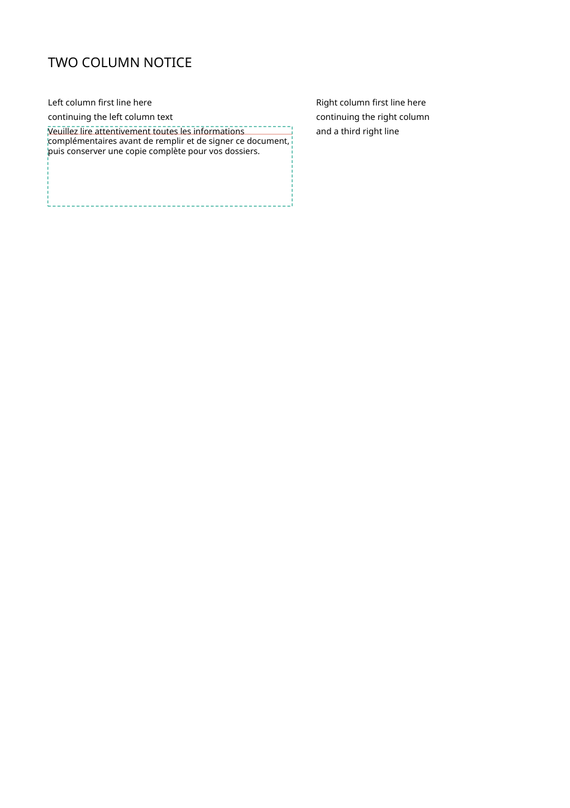
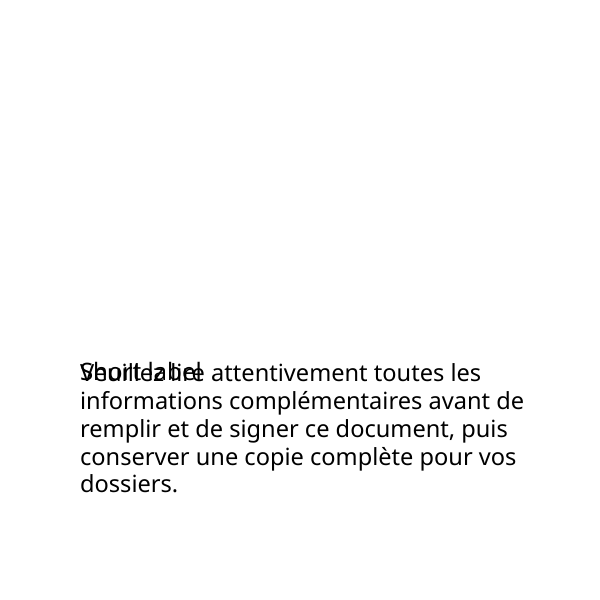

# B1 recovery probe — 19 September 2026

**Result:** the existing merge renderer placed all the diagnostic text inside
the fixed boxes in **6 of 8 deliberately stressed cases**, with the original
page counts, page sizes and widget rectangles preserved. The tight table cell
and last-page footer still refused. **None of the six preserved the first
baseline exactly.** These results demonstrate reflow potential, not a finished
B1 capability or a customer recovery rate.

**Recommendation:** keep the approved page-count and fixed-box constraints.
Do not size a build from the synthetic 6/8 result. Representative refused
translation jobs are still needed to measure customer coverage; current merges
also have measured baseline, size-reporting and occurrence-selection limits.

Scope: the operator approved the design, then said “ok proceed” after the
recommendation to measure the corpus before planning implementation. This is
that measurement. No library code, implementation plan, PR, or remote ref was
changed. [Approved canvas](../design/B1-line-wrapping/README.md).

<details>
<summary>Technical detail (skip freely)</summary>

## What was available to measure

The seed corpus contains 16 source PDFs with **extraction verdicts**, not paired
translation jobs. Re-extraction produced 13 eligible files with 72 segments,
one image-only refusal, one invisible-text-layer refusal, and one empty
pale page. The silent extraction API returns refusal reasons as data; it does
not raise for those two cases. The probe reads those fields when classifying.

Two locally saved translation jobs also rebuilt without refusal:

- `runs/gpt-6-2026-09-04`
- `runs/fresh-canary-2026-09-05/job`

Both are already revised, final mappings of the school permission fixture,
with an existing authored merge; they are not independent document classes or
an archive of failed attempts. Both produce two-page PDFs. They provide
**zero current refused builds**, so a real-job recovery fraction cannot be
estimated from them. Original inputs were read only; only font paths in scratch
copies were resolved to their existing absolute locations.

The product's reported form/invoice measurements were not imported or
reproduced. `C:\Dev\pdf-translator` was never opened.

## The controlled stress sample

The fixed cases and their rectangles are in
`dev/probes/b1_cases.json`. Six occurrences come from four seed PDFs; two
two-page controls are constructed by the probe. One Latin diagnostic payload
and one Japanese diagnostic payload are frozen in that file, not adjusted
to achieve a desired result per case. They deliberately replace short source
text with longer text: **they are not translations of those source labels**.
This is layout stress, not semantic quality evidence.

The baseline uses the ordinary line path. The candidate uses an existing
explicit one-member merge, with the same target text and a manually authored
box. No renderer was patched, no obstacle region inferred, no scale exception
enabled, and no source content was moved to another page. Nonselected text
is an identity mapping. The source renders and drawing coordinates informed
the selected boxes; the manifest states the reason for each.

| Case | Single line | Authored box | Pages, source → output | Effective size / source | First baseline delta |
| --- | --- | --- | --- | --- | --- |
| Tight table cell | Refused | Refused | 1 → no output | Required engine scale 0.510 | — |
| Left-column last line | Refused | Built, 3 lines | 1 → 1 | 0.9778 | −0.168 pt |
| Right-column last line | Refused | Built, 4 lines | 1 → 1 | 0.9778 | −0.168 pt |
| White banner | Refused | Built, 3 lines | 1 → 1 | 0.8719 | −2.481 pt |
| Blue last line | Refused | Built, 3 lines | 1 → 1 | 0.9800 | −1.278 pt |
| Japanese last line | Refused | Built, 3 lines | 1 → 1 | 0.9818 | −0.388 pt |
| Room on second page | Refused | Built, 5 lines | 2 → 2 | 0.9833 | +0.502 pt |
| Full last-page footer | Refused | Refused | 2 → no output | Required engine scale 0.517 | — |

All eight baseline refusals were overflow, with no missing translation or glyph
refusal. Both candidate refusals left no new output PDF. On each successful
candidate, the full target was on the source page, the existing placement gate
passed, the drawing font's embedded program matched the supplied file's SHA-256,
the target color survived, and painted target bounds remained in the authored
box at the measurement resolution. No painted target bounds intersected a
widget. This is not a general obstacle-safety or font-style guarantee: the
probe supplies the same regular face for all font roles.



## What prevents calling these compliant B1 recoveries

1. **Baseline anchoring is not supplied by an authored box alone.** All six
   first-line origins differ from the source. Deltas above are measured from
   the output text layer. The probe uses 0.01 pt only to distinguish numerical
   equality; it does not propose that as a new perceptual acceptance threshold.
   The result does not prove baseline preservation is impossible. It shows the
   existing merge path with these boxes is not a drop-in implementation of it.
2. **Engine scale is not effective source-relative size.** Five successful
   candidates have an empty scale report but print at 0.9778–0.9833 of the source
   size. The existing merge CSS uses `size * 0.98`, rounded to one decimal;
   `consider_ratio` receives the engine scale, not that combined ratio
   (`pdf_translate/retypeset.py:1425`, `:1428`). The banner reports an engine
   shrink, but its effective source-relative scale is smaller still. This is
   a measured distinction, not a fix in this session.
3. **Source text is not an occurrence identifier.** A separate control puts
   “Same label” at y=70 and y=190. Requesting a one-member merge in the second
   label's box removes the first matching label, and the remaining “Short label”
   stays at **[40, 190]**, not the expected **[40, 70]**. The new paragraph is
   drawn on top of the second label. This demonstrates the current matching
   limit; it does not prescribe a new API or selector schema.



## Audit limits and measurement corrections

The first diagnostic run is preserved under `run-01`; it is not the reported
result. It exposed three measurement/fixture issues corrected before `run-02`:

- Full span rectangles include unused font ascent and extended above every
  box. They cannot be treated as painted ink. The probe now isolates the final
  merge stream on an in-memory copy, asserts that its entire text equals the
  intended target, and measures the alpha pixels at **216 dpi**. The output
  PDF is never saved from that copy. Containment allows **one pixel (1/3 pt)**
  for raster boundary quantization, explicitly recorded in the JSON.
- The banner's origin was x=49.99998 for a box starting at x=50. Selecting spans
  now permits 0.001 pt of float roundoff; that is not an expanded layout budget.
- The constructed roomy-page control initially put its neighboring widget
  inside the author-requested box. The control was corrected so that widget
  starts at y=221, below the box ending at y=200. This is an authored fixture
  correction, not automatic obstacle avoidance in the library.

Full verification is recorded, not hidden. Only the blue-tail case has overall
verify exit 0; all six have placement PASS. Identity-mapped source text triggers
leak checks in other cases, and replacement of a short label by a long stress
paragraph triggers ink-ratio checks in the Japanese and two-page cases. These
are not six deliverable translations and the probe never claims otherwise.

The Japanese case has three newly wrapped lines and gate 19 returns
`PASS kinsoku: 6 CJK line(s) break within the rules`. The six include unchanged
lines. This is one inspected Japanese example, not a compliance sweep, not a
test of every prohibited punctuation class, and not shaping verification for
Indic or mark-stacking scripts. The no-new-break disclosure remains unbuilt.

## Reproduce

From the repo root in PowerShell, with a fresh output directory:

```powershell
$env:PYTHONUTF8='1'
& '.\pdf-translate.venv\Scripts\python.exe' 'dev/probes/b1_recovery_probe.py' --work 'runs/b1-recovery-probe-2026-09-19/reproduce'
```

Reported run: the same command with `--work
runs/b1-recovery-probe-2026-09-19/run-02`, **exit 0**. Python 3.14.0,
PyMuPDF/MuPDF 1.28.2, library v58 at checkout `1d4f970`. Output:

```text
table-cell: refused -> refused
left-column-tail: refused -> built
right-column-tail: refused -> built
banner: refused -> built
blue-tail: refused -> built
cjk-tail: refused -> built
two-page-room: refused -> built
last-page-full: refused -> refused
stress_cases: 8
baseline_refused: 8
box_builds: 6
bounded_text_recoveries: 6
also_preserve_baseline_to_0_01pt: 0
```

[Durable raw results](data/2026-09-19-b1-recovery.json) include the frozen
manifest hash, input font hashes, stress-source hashes, runtime, every refusal,
coordinates, colors, actual sizes, font attribution, and nonpassing gates.
Per-case PDFs, mappings, full verification reports, and renders live under the
run directory. The two historical jobs are optional local evidence; absent
jobs are recorded as unavailable, not substituted.

## Independent verification

An agent that did not author the probe reran it and independently read the PDFs.
Commands from the repo root, using the same venv and UTF-8 setting:

```powershell
& '.\pdf-translate.venv\Scripts\python.exe' 'dev/probes/b1_recovery_probe.py' --work 'runs/b1-recovery-probe-2026-09-19/independent-verify-a1'
& '.\pdf-translate.venv\Scripts\python.exe' 'runs/b1-recovery-probe-2026-09-19/independent-verify-a1/raw_audit.py' --work 'runs/b1-recovery-probe-2026-09-19/independent-verify-a1'
```

Both exited **0**. The probe reproduced 8 refusals, 6 builds, 6 bounded targets,
and 0 unchanged baselines. The separate audit printed:

```text
PASS independent raw-PDF checks; approved first-baseline requirement remains unsatisfied
```

Its reusable source is preserved unchanged as `dev/probes/b1_recovery_audit.py`.
Run that script with `--work` pointing to a completed probe run, from the repo
root. [Independent raw audit](data/2026-09-19-b1-independent-audit.json).

The independent pass inspected all six successful render PNGs and the duplicate
control. It verified exact page/field parity, measured origins and effective
sizes directly from the target stream, and walked nested `Do`/`Tf` font
resources to hash the actual drawing font. The Japanese instance's embedded
name says “Thin,” but its actual weight class is **400**, matching the input.

It also closed a limitation in the primary raster measurement: a form's clipping
box could conceal a partially clipped glyph even when the full string remains
extractable. The independent audit expands form BBoxes and removes explicit
clipping **on an in-memory copy**, then rasterizes at **432 dpi**. All six
unclipped targets still fit inside their authored boxes within one pixel
(1/6 pt), without intersecting other text spans or widgets. This corroborates
these files; the primary probe alone does not establish clipping safety for
arbitrary future cases.

## Stop point

The probe establishes limited mechanical potential and concrete gaps in the
existing route. It does **not** establish the product's “biggest coverage
lever” estimate. A representative refused-job sample with permissible boxes
is still missing; synthetic stress and already-fixed final jobs cannot supply
that denominator. No implementation plan or build follows automatically from
this result.

</details>
